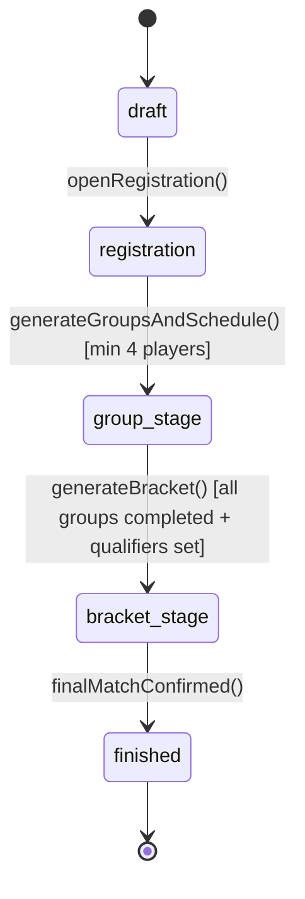

# TourneyMaster AI — Architecture Design Document

---

## 1. Architectural Principles

TourneyMaster AI is built upon four architectural pillars:

1. **Pure Domain Engine**: All business logic (scoring, seeding, scheduling, standings, rating, brackets, and state transitions) lives in `/lib/engine/` as pure TypeScript functions with zero I/O or framework dependencies.
2. **Server Actions for Mutations**: All state changes execute on the server through typed Next.js Server Actions with strict Zod validation, auth verification, and audit logging.
3. **Defense-in-Depth Row Level Security (RLS)**: Database constraints, RLS policies, and PostgreSQL stored procedures enforce security even if application logic is bypassed.
4. **Historical Archive Separation**: Historical tournament data (2024, 2025, 2026) is cleanly partitioned from live tournament states while feeding canonical player rating histories.

---

## 2. Domain Engine Architecture

```
                      ┌───────────────────────────┐
                      │    Tournament Workflow    │
                      └─────────────┬─────────────┘
                                    │
       ┌────────────────────────────┼────────────────────────────┐
       ▼                            ▼                            ▼
┌──────────────┐             ┌──────────────┐             ┌──────────────┐
│  seeding.ts  │             │ schedule.ts  │             │  scoring.ts  │
│ Snake Seeding│             │ Round-Robin  │             │ 7 / 11 / 15  │
└──────┬───────┘             └──────┬───────┘             └──────┬───────┘
       │                            │                            │
       └────────────────────────────┼────────────────────────────┘
                                    │
                                    ▼
                             ┌──────────────┐
                             │ standings.ts │
                             │ Tiebreakers  │
                             └──────┬───────┘
                                    │
       ┌────────────────────────────┴────────────────────────────┐
       ▼                                                         ▼
┌──────────────┐                                          ┌──────────────┐
│  bracket.ts  │                                          │  rating.ts   │
│ Cross-Group  │                                          │   Glicko-2   │
└──────────────┘                                          └──────────────┘
```

### 2.1 Table Tennis Scoring Rules (`scoring.ts`)
- **Group Stage**: Target = 7 points, win by ≥ 2 points (e.g. 7-0 to 7-5; 8-6, 9-7).
- **Knockout Stage (QF / SF)**: Target = 11 points, win by ≥ 2 points (e.g. 11-0 to 11-9; 12-10).
- **Finals**: Target = 15 points, win by ≥ 2 points (e.g. 15-0 to 15-13; 16-14).
- **Extended Play (Deuce)**: Occurs only when both players reach `target - 1`. Winner must lead by exactly 2 points.

### 2.2 Snake Seeding (`seeding.ts`)
- Players sorted by rating descending (tiebreaker: lower RD → more matches played → deterministic UUID).
- Assigned in serpentine order across groups:
  - Row 0: $A \to B \to C \to D$ (Seeds 1, 2, 3, 4)
  - Row 1: $D \to C \to B \to A$ (Seeds 5, 6, 7, 8)
  - Row 2: $A \to B \to C \to D$ (Seeds 9, 10, 11, 12)
  - ...

### 2.3 Group Standings & Official Tiebreakers (`standings.ts`)
1. **Total Wins (PG)** (descending)
2. **Head-to-Head (2-way tie)**: Direct winner ranked higher.
3. **Mini-League (3+ way tie)**: Matches strictly among tied players evaluated in order:
   - Mini-league wins
   - Mini-league point difference ($PF - PC$)
   - Mini-league points for ($PF$)
4. **Overall Point Difference** ($PF - PC$)
5. **Overall Points For** ($PF$)
6. **Seeding (Last resort deterministic)**

---

## 3. Historical Archive Architecture

```
                    ┌─────────────────────────┐
                    │   Historical CSV/JSON   │
                    └────────────┬────────────┘
                                 │
                                 ▼
                    ┌─────────────────────────┐
                    │   historical_imports    │
                    └────────────┬────────────┘
                                 │
         ┌───────────────────────┴───────────────────────┐
         ▼                                               ▼
┌─────────────────┐                             ┌───────────────────┐
│     players     │                             │historical_tourneys│
│ (Canonical ID)  │                             └─────────┬─────────┘
└────────┬────────┘                                       │
         │                                                ▼
         ▼                                      ┌───────────────────┐
┌─────────────────┐                             │historical_matches │
│ player_aliases  │                             └─────────┬─────────┘
└─────────────────┘                                       │
         │                                                │
         └───────────────────────┬────────────────────────┘
                                 │
                                 ▼
                     ┌───────────────────────┐
                     │ Chronological Replay  │
                     └───────────┬───────────┘
                                 │
         ┌───────────────────────┴───────────────────────┐
         ▼                                               ▼
┌──────────────────┐                           ┌────────────────────┐
│  rating_states   │                           │  rating_snapshots  │
│ (Current Glicko) │                           │  (Point in Time)   │
└──────────────────┘                           └────────────────────┘
```

1. **`players`**: Canonical player identity independent of auth user accounts.
2. **`player_aliases`**: Mapping of historical name variations (e.g. "Guille", "Guillermo R.") to canonical ID.
3. **`historical_imports`**: Audit trail of raw imports.
4. **`historical_tournaments` & `historical_matches`**: Immutable historical game records from 2024, 2025, and 2026.
5. **`rating_snapshots`**: Immutable point-in-time rating snapshots generated after each chronological tournament replay.
6. **`rating_states`**: Latest persisted skill ratings.

---

## 4. Glicko-2 Mathematical Implementation (`rating.ts`)

- **Skill Rating ($r$)**: Default 1500
- **Rating Deviation ($RD$)**: Default 350
- **Volatility ($\sigma$)**: Default 0.06
- **System Constant ($\tau$)**: 0.5

$$\mu = \frac{r - 1500}{173.7178}, \quad \phi = \frac{RD}{173.7178}$$

Volatility update uses the **Illinois algorithm** to find the root of the objective function:

$$f(x) = \frac{e^x (\Delta^2 - \phi^2 - v - e^x)}{2(\phi^2 + v + e^x)^2} - \frac{x - \ln(\sigma^2)}{\tau^2}$$

---

## 5. Tournament State Machine (`tournament-state.ts`)



- **Guards**:
  - `registration → group_stage`: Requires $\ge 4$ players and group generation.
  - `group_stage → bracket_stage`: Requires all groups to be `completed` and qualifiers configured.
  - `Mystery Mode`: Standings remain locked to players while any match in the group is `pending`, `submitted`, or `disputed`.
